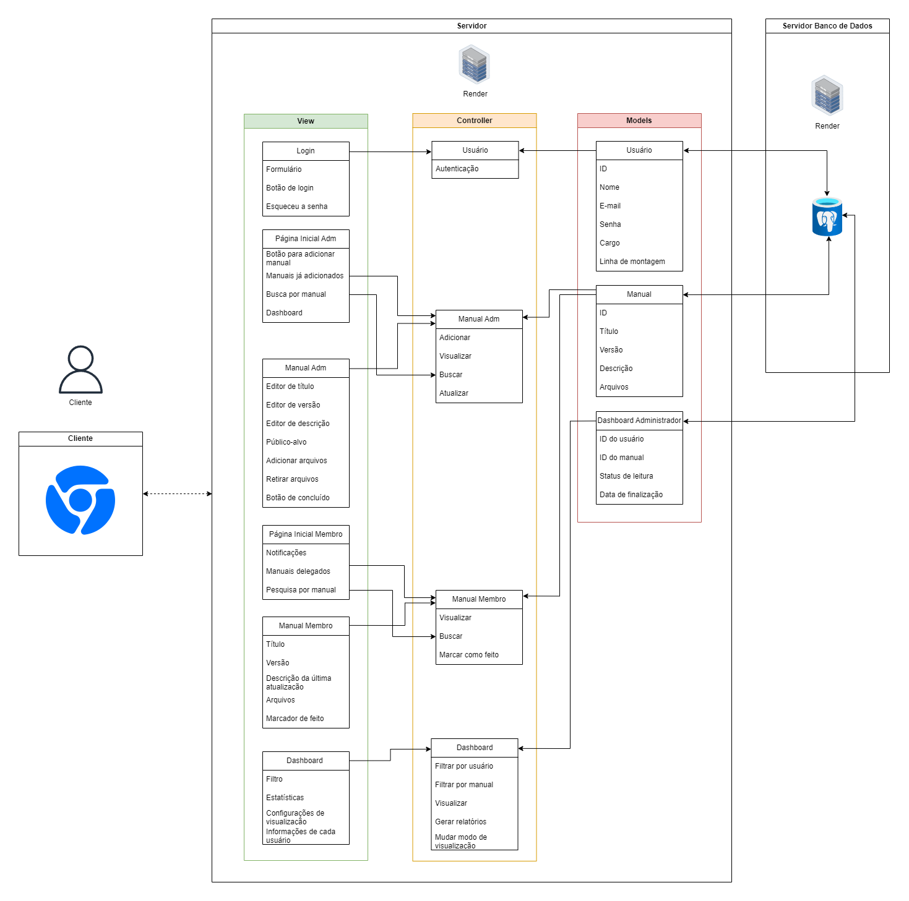

# MVC-M2
 
  

 Link: https://drive.google.com/file/d/1RSGk6yDcLpjSwBZBKBsbT_VCPtoo1rrE/view?usp=sharing 

 ## Informações Básicas:

  - **Nome do Projeto:** DIVE (Dell Interactive Virtual Enviroment)
  - **Descrição:** DIVE é uma aplicação web focada no treinamento de montadores da empresa Dell, disponibilizando manuais aos usuários identificados como membros e notificando quando algum arquivo for atualizado por um administrador. 
  - **Arquitetura:** MVC (Model-View-Controller)
  - **Ferramenta de Diagramação:** draw.io

 ## Models:
  ### Entidades
  #### Usuário 
   &nbsp;&nbsp;&nbsp;&nbsp; A entidade "Usuários" contém os atributos necessários para identificar com precisão um funcionário, sendo ele administrador ou membro.

   - **ID:** sequência de caracteres único para cada funcionário.
   - **Nome:** nome do funcionário.
   - **E-mail:** e-mail utilizado pelo funcionário para se registrar na plataforma.
   - **Senha:** senha utilizada pelo funcionário para entrar em sua conta.
   - **Cargo:** o funcionário deve ser identificado como membro ou administrador.
   - **Linha de montagem:** caso o funcionário seja identificado como membro, ele também poderá ser categorizado pela linha de montagem que trabalha.

  #### Manual 
   &nbsp;&nbsp;&nbsp;&nbsp; A entidade "Manual" guarda as informações dos manuais, permitindo que sejam identificados posteriormente.

   - **ID:** sequência de caracteres único para cada manual.
   - **Título:** nome do produto alvo.
   - **Versão:** conforme o manual for atualizado, deverá mudar a versão dele.
   - **Descrição:** quando houver uma atualização no manual, o adminitrador deverá adicionar uma descrição sobre o que foi modificado.
   - **Arquivos:** o arquivos que foram adicionados para que o montador estude.

  #### Dashboard Administrador  
   &nbsp;&nbsp;&nbsp;&nbsp; A entidade "Dashboard Administrador" retém as informações necessárias para as estatísticas apresentadas na dashboard do perfil de administrador.

   - **ID do usuário:** sequência de caracteres único para cada usuário. 
   - **ID do manual:** sequência de caracteres único para cada manual. 
   - **Status de leitura:** conforme o manual é lido pelos montadores, os status de leitura de cada manual muda de "a fazer" para "feito".
   - **Data de finalização:** registra a data em que o montador marcou o manual como lido.

  ### Relações
  #### Usuário <> Dashboard Administrador

   &nbsp;&nbsp;&nbsp;&nbsp; Para formular a dashboard no perfil do administrador, será necessário saber quais montadores leram os manuais delegados. Para isso, cada funcionário receberá um ID na entidade "Usuário" (chave primária), que será também utilizada em "Dashboard Administrador" (chave estrangeira). 

  #### Manual <> Dashboard Administrador

   &nbsp;&nbsp;&nbsp;&nbsp; Ao formular o dashboard que será mostrado para o administrador, o ID de cada manual será essencial, pois deverá haver um modo de se referenciar a um manual sem o risco do dado utilizado coincidir com o de outro material. Para isso, cada manual receberá um ID na entidade "Manual" (chave primária), que será também utilizada em "Dashboard Administrador" (chave estrangeira). 

 ## Controllers:

  ### Usuário

   &nbsp;&nbsp;&nbsp;&nbsp; O controlador "Usuário" é útil quando há uma tentativa de realizar login, pois após o formulário com e-mail e senha for preenchido, o método que realiza a autenticação do usuário é chamado. Para efetivar o login do funcionário, as credenciais inseridas são comparadas com aquelas já registradas no modelo "Usuário".

  #### Responsabilidades

  - Autenticação dos usuários
 
  #### Ações
  
  ##### Autenticação

  - **Parâmetros de entrada:** email, senha 
  - **Parâmetros de saída:** permissão

  ### Manual Adm

   &nbsp;&nbsp;&nbsp;&nbsp; O controlador "Manual Adm" é utilizado quando um administrador que interagir com os manuais, sendo para acessar, atualizar ou buscar algum já publicado, ou adicionar um novo. Durante todos esses processos, será necessário no mínimo o ID do manual ou a criação dele.

  #### Responsabilidades

  - Adicionar
  - Visualizar 
  - Buscar
  - Atualizar
 
  #### Ações
  
  ##### Adicionar

  - **Parâmetros de entrada:** título, versão, descrição, arquivos
  - **Parâmetros de saída:** novo manual

  ##### Visualizar

  - **Parâmetros de entrada:** ID do manual
  - **Parâmetros de saída:** manual

  ##### Buscar

  - **Parâmetros de entrada:** palavra(s) digitada(s)
  - **Parâmetros de saída:** manuais correspondentes

  ##### Atualizar

  - **Parâmetros de entrada:** ID do manual, informações atualizadas (ex: título, descrição, arquivos...)
  - **Parâmetros de saída:** manual atualizado

  ### Manual Membro

   &nbsp;&nbsp;&nbsp;&nbsp; O controlador "Manual Membro" será aplicado quando um funcionário identificado como membro quiser interagir com um manual. Assim, tem conexão direta com o madelo "Manual", o qual contém informações cruciais para a identificação do manual que será mostrado ou buscado.

  #### Responsabilidades

  - Visualizar 
  - Buscar
  - Marcar como feito

  #### Ações

  ##### Visualizar

  - **Parâmetros de entrada:** ID do manual
  - **Parâmetros de saída:** manual

  ##### Buscar

  - **Parâmetros de entrada:** palavra(s) digitada(s)
  - **Parâmetros de saída:** manuais correspondentes

  ##### Marcar como feito

  - **Parâmetros de entrada:** ID do manual
  - **Parâmetros de saída:** manual reconhecido como "feito"

  ### Dashboard

   &nbsp;&nbsp;&nbsp;&nbsp; O controlador "Dashboard" contém as ações possíveis do administrador sob as estatísticas geradas, as quais tem como base as tarefas realizadas pelos montadores. Dessa forma, se relaciona diretamente com a view "Dashboard", uma vez que inclui as ações que podem ser feitas a partir das opções mostradas ao funcionário. Além disso, as funções representadas por esse controlador dependem diretamente da modelo "Dashboard Administrador", pois ele guarda as informções necessárias para formar os dados que serão apresentados.

  #### Responsabilidades

  - Filtrar por usuário
  - Filtrar por manual
  - Visualizar
  - Gerar relatórios
  - Mudar modo de visualização

  #### Ações

  ##### Filtrar por usuário

  - **Parâmetros de entrada:** ID do usuário, ID dos manuais, status de leitura
  - **Parâmetros de saída:** relatório

  ##### Filtrar por manual

  - **Parâmetros de entrada:** ID dos usuários, ID do manual, status de leitura, data de finalização
  - **Parâmetros de saída:** relatório

  ##### Visualizar

  - **Parâmetros de entrada:** dados gerados a partir das informações sobre status de leitura e data de finalização das leituras de cada funcionário sob cada manual
  - **Parâmetros de saída:** tabelas com as estatísticas

  ##### Gerar relatórios
 
  - **Parâmetros de entrada:** ID do usuário, ID do manual, status de leitura, data de finalização
  - **Parâmetros de saída:** estatísticas baseadas nos dados de leitura dos manuais 

  ##### Mudar modo de visualização

  - **Parâmetros de entrada:** dados gerados a partir das informações sobre status de leitura e data de finalização das leituras de cada funcionário sob cada manual
  - **Parâmetros de saída:** gráficos que mostrem as estatísticas

 ## Views:

 - **Login:** Permite o login dos usuários na aplicação.
 - **Página Inicial Adm:** Permite ao administrador a visualização dos manuais, a adição de novos, buscar por algum em específico e analisar dados estatísticos sobre as tarefas que os montadores realizaram.
 - **Manual Adm:** Permite ao administrador editar qualquer informção do manual.
 - **Página Inicial Membro:** Permite ao membro a visualização dos manuais delegados a ele, ver quais deles foram atualizadose e buscar entre todos os manuais.
 - **Manual Membro:** Permite ao membro visualizar todos os detalhes do manual e quais arquivos foram anexados a ele.
 - **Dashboard:** Dá ao administrador um panorâma sobre o andamento dos estudos de seus funcionários.

 ## Infraestrutura:

 ### Banco de Dados

  - Como banco de dados, foi escolhido o PostegreSQL, o qual permite a retenção de dados de forma relacional e eficiente.
  - Ele é representado no MVC na parte "Models", onde são listadas as informações que devem ser armazanadas. Essa área do MVC se relaciona diretamente com "Controllers", que mostra o que é feito com esses dados.

 ### API

  - A aplicação web que está sendo desenvolvida poderia ter uma integração com a API da Dell, a qual forneceria informações recentes sobre manuais, por exemplo. 
  - A API se relacionaria diretamente com a parte de controllers do MVC, pois os dados nela apresetados poderiam estar sempre atualizados por meio dessa integração.

 ## Implicações da Arquitetura:

 ### Escalabilidade

   - A arquitetura MVC permite a adição de funcionalidades sem ter uma restruturaçao do código.

 ### Manutenção

   - A arquitetura MVC permite a manutenção do código com grande facilidade, pois as responsabilidades são definidas e separadas préviamente.

 ### Testabilidade

   - Uma vez que o código é separado em "camadas", testá-lo se torna mais simples, podendo ser reproduzido por partes.

 ### Flexibilidade

   - O MVC permite uma alteração ágil na aparência da aplicação, pois não há a necessidade de mudar o código do models ou do controllers.